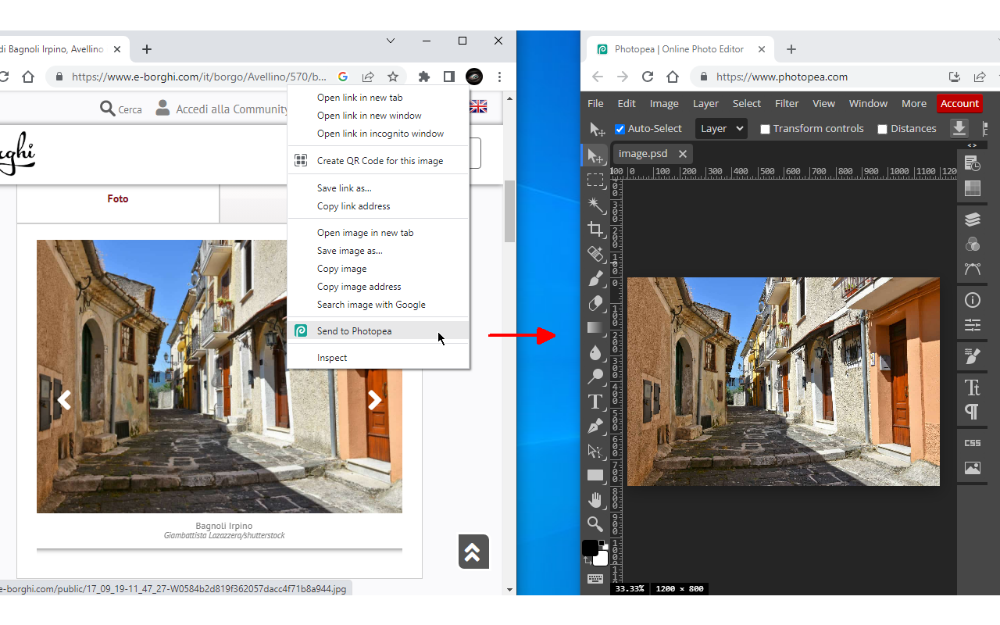

# send2photopea
Send image to Photopea Chrome Extension

You can find it here: https://chrome.google.com/webstore/detail/send2photopea/ngjdphpkaopdenfbgkkkgmajgcmhpkme

# Overview
Right-click and send images right to Photopea.
If you have an instance of Photopea open, the image will be sent there.

Browse and edit your images, faster.

CHANGELOG: https://github.com/azrafe7/send2photopea/blob/main/CHANGELOG.md

DISCLAIMER: I'm not affiliated with Photopea, just a big fan of it. :D
